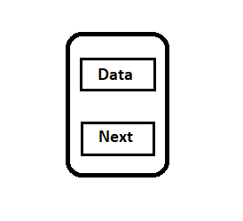
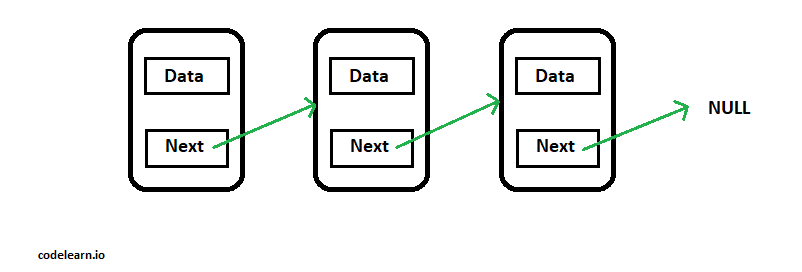
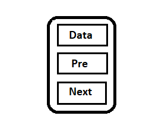
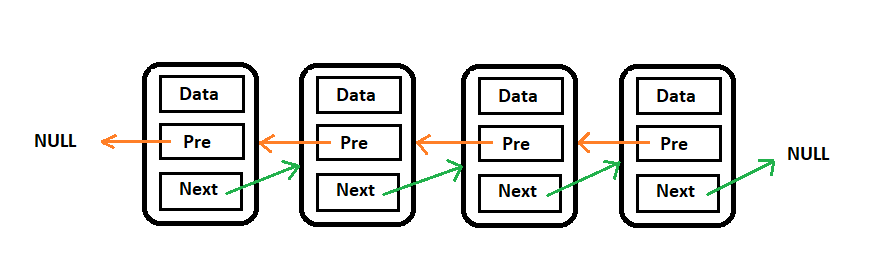

`Danh sách liên kết đơn` là một tập hợp các Node được phân bố động, được sắp xếp theo cách sao cho mỗi Node chứa một giá trị (Data) và một con trỏ (Next). Con trỏ sẽ trỏ đến phần tử kế tiếp của danh sách liên kết đó. Nếu con trỏ mà trỏ tới NULL, nghĩa là đó là phần tử cuối cùng của linked list.

Hình ảnh mình họa một `node`:

Hình ảnh mình họa một `listLinker`:

**Lưu ý**: Con trỏ sẽ trỏ tới vị trí của node, cần lưu ý trước khi thay đổi để tránh mất node

***

`Danh sách liên kết đôi (Doubly Linked List)` là một tập hợp các Node được phân bố động, được sắp xếp theo cách sao cho mỗi Node chứa:

- Một giá trị (Data).
- Một con trỏ (Next) sẽ trỏ đến phần tử kế tiếp của danh sách liên kết đó, nếu con trỏ mà trỏ tới NULL, nghĩa là đó là phần tử cuối cùng của douList.
- Một con trỏ (Pre) sẽ trỏ đến phần tử trước của danh sách liên kết đó, nếu con trỏ mà trỏ tới NULL, nghĩa là đó là phần tử đầu tiên của doulist.

Hình ảnh mình họa cho một node trong douList.

Hình ảnh đầy đủ của một danh sách liên kết đôi.

