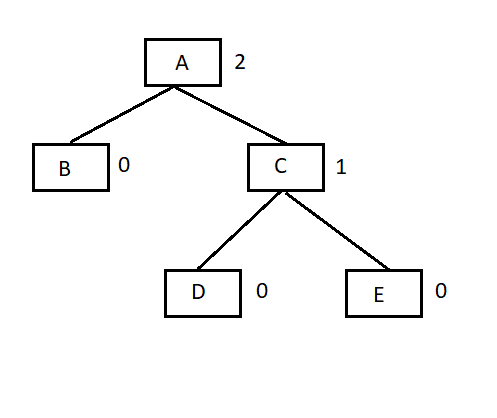
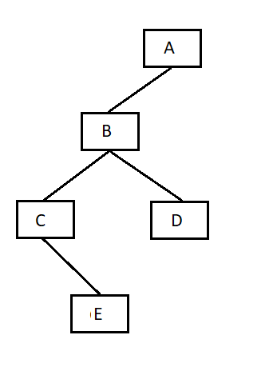
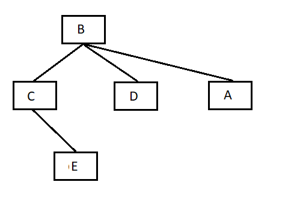
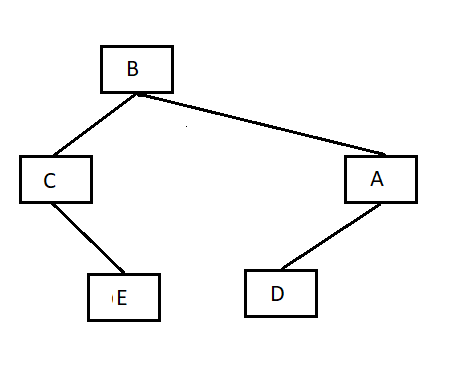
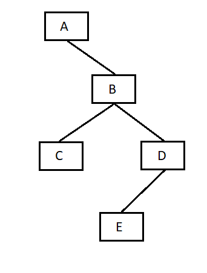
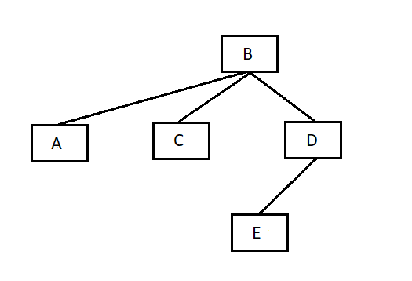
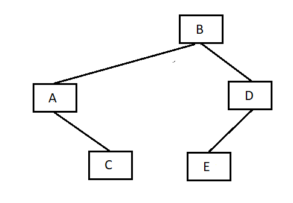

`Cây nhị phân` là một cấu trúc dữ liệu đặc biệt được sử dụng cho mục đích lưu trữ dữ liệu. Một cây nhị phân có một điều kiện đặc biệt là mỗi nút có thể có tối đa hai nút con. Một cây nhị phân tận dụng lợi thế của hai kiểu cấu trúc dữ liệu: một mảng đã sắp thứ tự và một danh sách liên kết (Linked List), do đó việc tìm kiếm sẽ nhanh như trong mảng đã sắp thứ tự và các thao tác chèn và xóa cũng sẽ nhanh bằng trong Linked List.


# Các khái niệm cơ bản về cây nhị phân

- `Đường`: là một dãy các nút cùng với các cạnh của một cây.

- `Nút gốc (Root)`: nút trên cùng của cây được gọi là nút gốc. Một cây sẽ chỉ có một nút gốc và một đường xuất phát từ nút gốc tới bất kỳ nút nào khác. Nút gốc là nút duy nhất không có bất kỳ nút cha nào.

- `Nút cha`: bất kỳ nút nào ngoại trừ nút gốc mà có một cạnh hướng lên một nút khác thì được gọi là nút cha.

- `Nút con`: nút ở dưới một nút đã cho được kết nối bởi cạnh dưới của nó được gọi là nút con của nút đó.

- `Nút lá`: nút mà không có bất kỳ nút con nào thì được gọi là nút lá.

- `Cây con`: cây con biểu diễn các con của một nút.

- `Truy cập`: kiểm tra giá trị của một nút khi điều khiển là đang trên một nút đó.

- `Duyệt`: duyệt qua các nút theo một thứ tự nào đó.

- `Bậc`: bậc của một nút biểu diễn số con của một nút. Nếu nút gốc có bậc là 0, thì nút con tiếp theo sẽ có bậc là 1, và nút cháu của nó sẽ có bậc là 2, …

- `Khóa (Key)`: biểu diễn một giá trị của một nút dựa trên những gì mà một thao tác tìm kiếm thực hiện trên nút.

# Biểu diễn cây tìm kiếm nhị phân.

`Cây tìm kiếm nhị phân` biểu diễn một hành vi đặc biệt. Con bên trái của một nút phải `có giá trị nhỏ hơn` giá trị của nút cha (của nút con này) và con bên phải của nút phải `có giá trị lớn hơn` giá trị của nút cha (của nút con này).

Hình minh họa:


Khai báo một node trong của cây:

```js
function node(data = null){
    this.data = data;
    this.left = null;
    this.right = null;
}
```
## Thêm phần tử

Để thêm phần tử vào cây nhị phân tìm kiếm ta làm như sau:

- Nếu cây đang rỗng, thì chọn luôn phần tử thêm vào làm node gốc.
- Nếu cây khác rỗng: data của node lớn hơn phần tử thêm vào, thì gọi hàm đệ quy để thêm phần tử đó và node left và ngược lại.

```js
class BinaryTree{
    constructor() {
        this.root = null; // Gốc của cây
    }

    insert(data) {
        const newNode = new Node(data);
        if (this.root === null) {
            this.root = newNode;
        } else {
            this.#insertNode(this.root, newNode);
        }
    }

    // hàm phụ trợ
    #insertNode(node, newNode) {
        if (newNode.data < node.data) {
            if (node.left === null) {
                node.left = newNode;
            } else {
                this.#insertNode(node.left, newNode);
            }
        } else {
            if (node.right === null) {
                node.right = newNode;
            } else {
                this.#insertNode(node.right, newNode);
            }
        }
    }
}
```

## Duyệt cây:

Duyệt cây là một tiến trình để truy cập tất cả các nút của một cây và cũng có thể in các giá trị của các nút này. Bởi vì tất cả các nút được kết nối thông qua các cạnh (hoặc các link), nên chúng ta luôn luôn bắt đầu truy cập từ nút gốc. Do đó, chúng ta không thể truy cập ngẫu nhiên bất kỳ nút nào trong cây. Có ba phương thức mà chúng ta có thể sử dụng để duyệt một cây:

- Duyệt tiền thứ tự (Pre-order Traversal)
- Duyệt trung thứ tự (In-order Traversal)
- Duyệt hậu thứ tự (Post-order Traversal)


### Duyệt trung thứ tự:

Nếu một cây nhị phân được duyệt trung thứ tự, kết quả tạo ra sẽ là các giá trị khóa được sắp xếp theo thứ tự tăng dần.

Ở hình ví dụ minh họa, A là nút gốc. Với phương thức duyệt trung thứ tự, chúng ta bắt đầu từ nút gốc A, di chuyển tới cây con bên trái B của nút gốc. Tại đây, B cũng được duyệt theo cách thức duyệt trung thứ tự. Và tiến trình tiếp tục cho đến khi tất cả các nút đã được truy cập. Kết quả của cách thức duyệt trung thứ tự cho cây trên sẽ là: `D → B → E → A → F → C → G.` đã được sắp sếp tăng dần 

Duyệt cho tới khi tất cả các nút đều được duyệt:

Bước 1: Duyệt các cây con bên trái một cách đệ qui

Bước 2: Truy cập nút gốc

Bước 3: Duyệt các cây con bên phải một cách đệ qui


```js
printTree(node = this.root, memo = []) {
    if (node !== null) {
        this.printTree(node.left, memo);
        memo.push(node.data)
        this.printTree(node.right, memo);
    }

    if (node === this.root) {
        console.log(memo.join(" "));
    }
}
```

### Duyệt tiền thứ tự.

Trong cách thức duyệt tiền thứ tự trong cây nhị phân, nút gốc được duyệt đầu tiên, sau đó sẽ duyệt cây con bên trái và cuối cùng sẽ duyệt cây con bên phải.


Ở hình ví dụ minh họa, A là nút gốc. Chúng ta bắt đầu từ A, và theo cách thức duyệt tiền thứ tự, đầu tiên chúng ta truy cập chính nút gốc A này và sau đó di chuyển tới nút con bên trái B của nó. B cũng được duyệt theo cách thức duyệt tiền thứ tự. Và tiến trình tiếp tục cho tới khi tất cả các nút đều đã được truy cập. Kết quả của cách thức duyệt tiền thứ tự cây này sẽ là: `A → B → D → E → C → F → G.`

Duyệt cho tới khi tất cả các nút đều được duyệt:
- Bước 1: Truy cập nút gốc
- Bước 2: Duyệt các cây con bên trái một cách đệ qui
- Bước 3: Duyệt các cây con bên phải một cách đệ qui

```js
printTree(node = this.root, memo = []) {
    if (node !== null) {
        memo.push(node.data)
        this.printTree(node.left, memo);
        this.printTree(node.right, memo);
    }

    if (node === this.root) {
        console.log(memo.join(" "));
    }
}
```

### Duyệt hậu thứ tự:

Trong cách thức duyệt hậu thứ tự trong cây nhị phân, nút gốc của cây sẽ được truy cập cuối cùng, do đó bạn cần chú ý. Đầu tiên, chúng ta duyệt cây con bên trái, sau đó sẽ duyệt cây con bên phải và cuối cùng là duyệt nút gốc


Ở hình ví dụ minh họa, A là nút gốc. Chúng ta bắt đầu từ A, và theo cách duyệt hậu thứ tự, đầu tiên chúng ta truy cập cây con bên trái B. B cũng được duyệt theo cách thứ duyệt hậu thứ tự. Và tiến trình sẽ tiếp tục tới khi tất cả các nút đã được truy cập. Kết quả của cách thức duyệt hậu thứ tự của cây con trên sẽ là: `D → E → B → F → G → C → A.`

Duyệt cho tới khi tất cả các nút đều được duyệt:
- Bước 1: Duyệt các cây con bên trái một cách đệ qui
- Bước 2: Duyệt các cây con bên phải một cách đệ qui
- Bước 3: Truy cập nút gốc.

```js
printTree(node = this.root, memo = []) {
    if (node !== null) {
        this.printTree(node.left, memo);
        this.printTree(node.right, memo);
        memo.push(node.data)
    }

    if (node === this.root) {
        console.log(memo.join(" "));
    }

```

# AVLTree

`Cây AVL` (viết tắt của tên các nhà phát minh Adelson, Velski và Landis) là cây tìm kiếm nhị phân có độ cân bằng cao. Cây AVL kiểm tra độ cao (bậc) của các cây con bên trái và cây con bên phải và bảo đảm rằng hiệu số giữa chúng là không lớn hơn 1. Hiệu số này được gọi là `Balance Factor` (Nhân tố cân bằng).

Hình ảnh ví dụ của cây AVL:



```js
class Tree{
    // ...
    countLevel(node = this.root){
        if (!node) return 0;
        return 1 + Math.max(this.countLevel(node.left), this.countLevel(node.right));
    }

    checkAvl(node = this.root){
        if (!node) return "true";
        if (Math.abs(this.countLevel(node.left) - this.countLevel(node.right)) > 1) return "false";
        return this.checkAvl(node.left) && this.checkAvl(node.right);
    }

    // ...
}
```

# Kỹ thuật xoay tree

## Xoay phải

Kỹ thuật này thường áp dụng cho những cây nhị phần tìm kiếm bị lệch về bên trái (độ cao của cây con trái lớn hơn độ của của cây con phải).



Với cách xoay này ta cần quan tâm tới node gốc (A) cây con bên trái (B) và cây con bên phải của cây con bên trái (D).

Cách xoay:

- Biến đổi node B thành node gốc, node gốc (A) thành cây con bên phải của B.

    

- Nếu như trên hình thi node B có tới 3 cây con, sai quy tắc của cây nhị phân, nên ta cần chuyển node D thành node con trái của A.

    (lưu ý là 2 hoạt động trên diễn ra cùng lúc nên cần phải thêm một số node tạm).

    

- Demo code:

    ```js
    class Tree{
        // ...
        turnRight(node = this.root){
            let turn = node.left;
            let temp = turn.right;

            node.left = temp;
            turn.right = node;

            return turn;
        }
        // ...
    }
    ```

## Xoay trái.

Kỹ thuật này thường áp dụng cho những cây nhị phần tìm kiếm bị lệch về bên phải(độ cao của cây con phải lớn hơn độ của của cây con trái).



Với cách xoay này ta hoàn toàn làm ngược lại cách xoay trái.

Với cách xoay này ta cần quan tâm tới node gốc (A) cây con bên trái (B) và cây con bên phải của cây con bên trái (C).

Cách xoay:

- Gán node trái của B bằng A:

    

- Gán node con bên phải của A bằng C:

    

- Demo code: 

    ```js
    class Tree{
    // ...
    turnLeft(node = this.root){
        let turn = node.right;
        let temp = turn.left;

        node.left = temp;
        turn.right = node;

        return turn;
    }
    
    // ...
    ```
## Cách trường hợp xử lý cần bằng để thành cây AVL

Có 4 trường hợp lệch trong cây nhị phân tìm kiếm:

- `Lệch trái - trái:` là node cha có độ cao của cây con bên trái lớn hơn cây con bên phải, và đối với cây con bên trái thì độ cao của cây con trái cũng lớn hơn cây con phải.

    Với những trường hợp lệch trái - trái, ta xử lý rất đơn giản, chỉ cần xoay phải cây là được.


- `Lệch trái - phải:` là node cha có độ cao của cây con bên trái lớn hơn cây con bên phải, và đối với cây con bên trái thì độ cao của cây con phải lớn hơn cây con trái.

    Với trường hợp lệnh trái - phải, ta phải thực hiện 2 phép xoay:

    - Xoay trái trái ở cây con bên trái.
    - Xoay phải cây.
- `Lệch phải - phải:` chỉ cần xoay trái cây là được.
- `Lệch phải  - trái:` ta phải thực hiện 2 phép xoay ngược lại với trái phải


- Demo

```js
class AVLTree {
    constructor() {
        this.root = null;
    }

    countLevel(node = this.root) {
        if (!node) return 0;
        return 1 + Math.max(this.countLevel(node.left), this.countLevel(node.right));
    }

    turnRight(node) {
        let b = node.left;
        let d = b.right;
        node.left = d;
        b.right = node;
        return b;
    }

    turnLeft(node) {
        let b = node.right;
        let d = b.left;
        node.right = d;
        b.left = node;
        return b;
    }

    updateTreeAVL(node = this.root) {
        if (!node) return null;

        if (Math.abs(this.countLevel(node.left) - this.countLevel(node.right)) > 1) {
            if (this.countLevel(node.left) > this.countLevel(node.right)) {
                let cur = node.left;
                if (this.countLevel(cur.left) >= this.countLevel(cur.right)) {
                    node = this.turnRight(node);
                } else {
                    node.left = this.turnLeft(cur);
                    node = this.turnRight(node);
                }
            } else {
                let cur = node.right;
                if (this.countLevel(cur.right) >= this.countLevel(cur.left)) {
                    node = this.turnLeft(node);
                } else {
                    node.right = this.turnRight(cur);
                    node = this.turnLeft(node);
                }
            }
        }

        if (node.left && node.left !== node) node.left = this.updateTreeAVL(node.left);
        if (node.right && node.right !== node) node.right = this.updateTreeAVL(node.right);

        return node;
    }
}
```